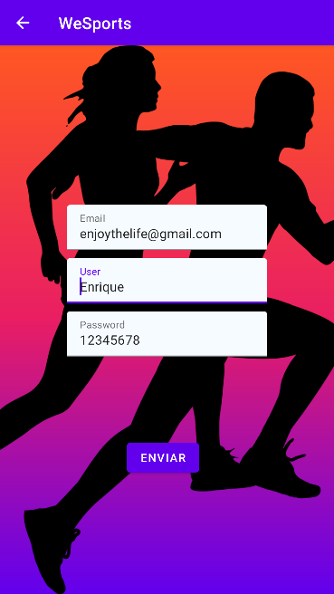
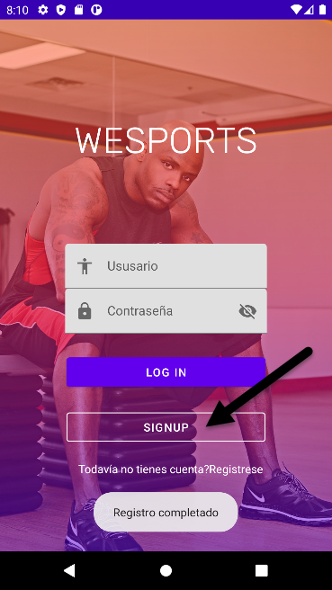
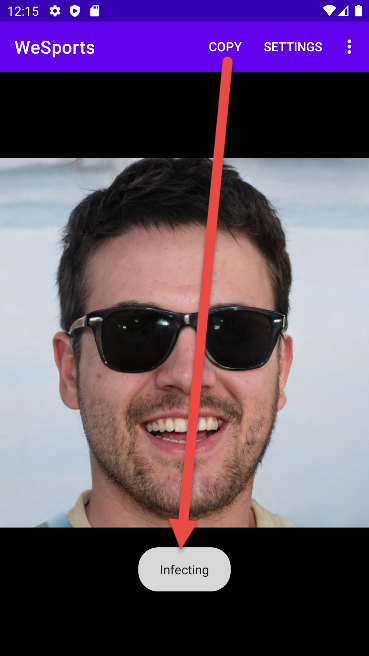

# WeSports
Es una aplicación de encuentros deportistas, eventos, gimnasios, etc ... que los clientes
siempre podrán utilizar en cualquier momento y lugar que quieran hacer deportes en la ciudad de Madrid y en cualquier municipio de la comunidad de Madrid. También es una aplicación
que monitoriza tus progresos para alcanzar tus objetivos fitness.

## Icono de la Aplicación
Se compone por un fondo energético de color naranja (que recuerda al amanecer o al atardecer), así nuestros usuarios enfocarán el uso de los servicios
de la aplicación en las horas de luz y conseguir además un atractivo de la aplicación. Gracias nuestro logotipo que consiste en una mancuerna para motivar
a los deportistas fortalecerse y desarrollarse físicamente.

El objetivo de la ventana de nuestro Splash es motivar a los usuarios de la aplicación
a instalársela para poder hacer cualquier deporte en cualquier lugar.

### Animación
Además en este activity tiene cargada una imación en el logitipo que motiva a nuestros los usuarios
a coger sus mancuernas y entrenar.

## Login
Al cargar la activity del login nuestra aplicación introduce a nuestros usuarios al mundo del fitness
y del gimnasio. Para poder registrarnos en nuestra aplicación hay que acceder a registro y rellenarlo
pulsando al botón Signup.

## Signup
En nuestra activity de registro los usuarios podrán registrarse con unos registros
muy sencillos de completar.

Al completar el registro pulsando al boton enviar, vuelve al login con un mensaje de la aplicación
informando al usuario que su registro ha sido completado (mediante un Toast).  Así los usarios podrán registrarse
e iniciar sesión en la aplicación para poder aprovechar todas sus funcionales, ventajas, facilidades, para cumplir sus objetivos
deportivos.

En nuestro main tenemos un reflesh, que nos carga imágenes de personas,
simulando los perfiles de nuestros usuarios para formar grupos de deportistas.

### Menú y ventana emergente

En el mismo main podremos observar que aparece un app bar con distintas opciones,
que lanzarán: mensajes, menús despegables y ventanas emergentes y de dialogo.

## Control de Versiones
El Control de versiones se ha llevado a cabo mediante Git y Github. Podéis consultar la evolución de la aplicación y sus distintas ramas
de las cuales la rama por defecto es esta, la del AlertDialog que es la último que hemos implementado a nuestra apliación

### Esquema commits y ramas Github

### Rama colaboración
La animación del login a sido una aportación del desarrollador: Manuel Arias Mateos.
Ha incorporado una animación al nombre de la aplicación de nuestro logín, programando
que el texto parpadé simulando la respiración de nuestros deportistas ususarios de la aplicación.

