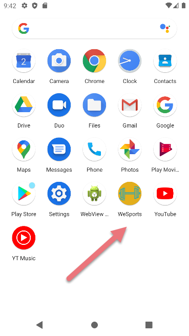

## WeSports
Es una aplicacion de encuntros deportistas,eventos,gymnasios,etc que los clientes
siempre podrán utilizar en cualquier momento y lugar que quieran hacer deportes.
## Logo de la Aplicación
Se compone por un fondo energético de color naranja(que recuerda al amancer o al atardecer)

El objetivo de la ventana de nuestro Splahs es motivar a los ususarios de la aplicacion
a poder instalársela para poder hacer cualquier deporte en cualquier lugar.

## Animación

## Login
Al cargar la activity del login nuestra aplicación introduce a nuestros usuarios al mundo del fitness
y del gimnasio. Para poder registrarnos en nuestra aplicación hay que acceder a registro y rellenarlo
pulsando al boton Signup.

## Signup
En nuestra activity de regsitro los usuarios podrán registrarse con unos registros
muy sencillos de completar.

Al completar se nuestro registro nuestro registro se cierra volviendo al login con un mensaje de la apliación
informándo al usuario que su regsitro ha sido completado(mediante un Toast)

En nuestro main tenemos un reflesh que nos carga imagenes de personas
simulando los perfiles de nuestros usuarios para formar grupos de deportistas

### Menu y ventana emergente

En el mismo main podremos Observar que aparece un app bar con distintas opciones
que lanzarán mensajes, menus despegables y ventanas emergentes y de dialogo.

